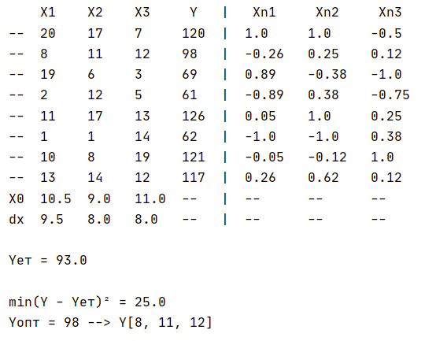

#### Виконав:
- Студент групи ІО-93
- Комаровський Роман Сергійович
- Номер у списку: 14
#### Перевірив:
- ас. Регіда П. Г.

## Завдання

## Виконання

## Відповіді на контрольні запитання
#### 1.	З чого складається план експерименту?
> План експерименту складається із сукупності усіх точок плану Xi (i = 1, 2, 3…, N) – набори конкретних значень усіх К-факторів. Таким чином, план експерименту описується матрицею, яка містить N рядків та К стовбців. Кожен рядок матриці означає точку плану експерименту, а стовпчик – фактор есперименту.

#### 2.	Що називається спектром плану?
> Спектром плану називається сукупність усіх точок плану, що відрізняються рівнем хоча б одного фактора, а матриця, отримана із усіх різних строк, називається матрицею спектра плану.

#### 3.	Чим відрізняються активні та пасивні експерименти?
> Експерименти поділяють на пасивні та активні (керовані). В пасивному експерименті існують контрольовані, але некеровані вхідні параметри – ми не маємо можливості втручатись в хід проведення експерименту, і виступаємо в ролі пасивного користувача. В активному – існують керовані і контрольовані вхідні параметри – ми самі являємось адміністраторами нашої системи.

#### 4.	Чим характеризується об’єкт досліджень? Дайте визначення факторному простору.
> Об’єкт досліджень розглядається як «чорний ящик». Аналізуються деякі властивості та якості, які можуть описуватися числовими значеннями.
Характеризується вектором змінних величин, які називають факторами та залежністю реакції об’єкта від точки факторного простору - функцією відгуку. Факторний простір  - простір незалежних змінних(факторів), діапазон значень факторів.
